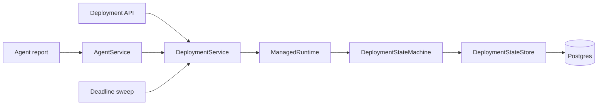
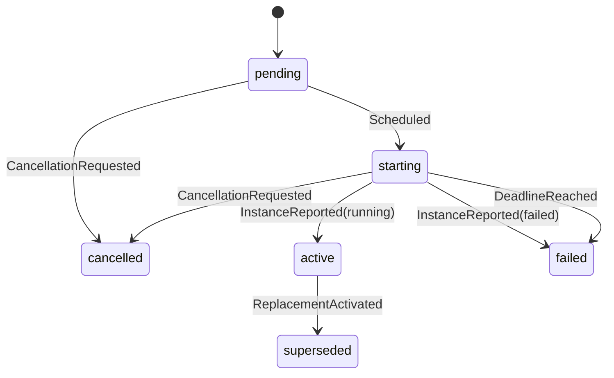

# Effect deployment state machine

This branch is an architectural slice, not the deployment CRUD feature. It adds the durable
state fields and the control-loop integration needed to judge whether Effect plus Postgres is
enough for the API-to-agent workflow. The app, artifact, and snapshotted config columns can be
added when those API resources land.

## Control loop

`DeploymentService` is the application boundary. It owns one `ManagedRuntime`, exposes Promises
to the existing service graph, starts the deadline sweep with Elysia, and disposes the runtime on
shutdown. Everything inside that boundary remains an Effect with explicit requirements and typed
errors.

The state machine is driven by facts rather than one-shot commands:

- scheduling records the desired-state generation and activation deadline;
- an agent report can activate or fail a deployment only after observing that generation;
- repeated and stale reports are unchanged results;
- a clock-driven scan recovers every elapsed deadline after a restart;
- cancellation and replacement are persisted before their callers can observe success.

Each write is an optimistic compare-and-set on the current state. Concurrent API replicas may
observe the same row or sweep the same deadline; one wins, and the others re-read before retrying.
Only compare-and-set conflicts are retried. Persistence failures and invalid transitions remain
visible to the caller.

## Effect design

The implementation follows the APIs and patterns in the `effect@3.22.1` source tag:

- `Effect.Tag` and `Layer` describe the state machine and storage capabilities. The experimental
  `Effect.Service` helper is intentionally not used.
- `Data.TaggedEnum` defines events and results, and `Match.tagsExhaustive` makes adding an event a
  compile-time change to the transition algebra.
- `Data.TaggedError` keeps persistence, concurrency, not-found, and invalid-transition failures in
  the typed error channel.
- `Effect.fn` names traced operations and span annotations carry deployment and event identifiers.
- `DateTime.nowAsDate` uses Effect's clock; the deadline test replaces it with `TestClock` rather
  than waiting or mocking global time.
- `Schedule.spaced` plus jitter keeps deadline recovery simple without synchronizing every API
  replica into the same polling spike.
- `ManagedRuntime` is used only at the application edge and is explicitly disposed.

Direct module imports are used throughout so dependencies stay visible and the generated binary
does not pull the package barrel into every module.

## Durability boundary

Effect does not make a fiber durable. Postgres makes this particular workflow recoverable because
the desired state, current state, target generation, and deadlines are data, while agent reports
are level-triggered observations. On restart, reports arrive again and the sweep reconstructs the
work due from persisted rows. No in-memory timer or fiber is a source of truth.

That is enough while every side effect is either a Postgres write or desired state repeatedly
polled by the agent. A durable workflow engine or transactional outbox becomes useful if a future
transition must coordinate non-idempotent external effects, preserve an event history, wait on
human input, or guarantee a multi-step sequence that cannot be reconstructed from current data.

## Deliberate gaps in this slice

- Deployment creation and its app/artifact/config relationships are not on `main`, so this branch
  does not invent their controller contract.
- The current product has one desired instance per deployment. Replica-set activation would need
  an explicit quorum policy and persisted expected membership before reports should be folded.
- The hard-coded desired-state fixture predates persisted deployments. Unknown deployment IDs in
  reports are ignored so old or not-yet-migrated instances remain level-triggered observations,
  not API failures.
